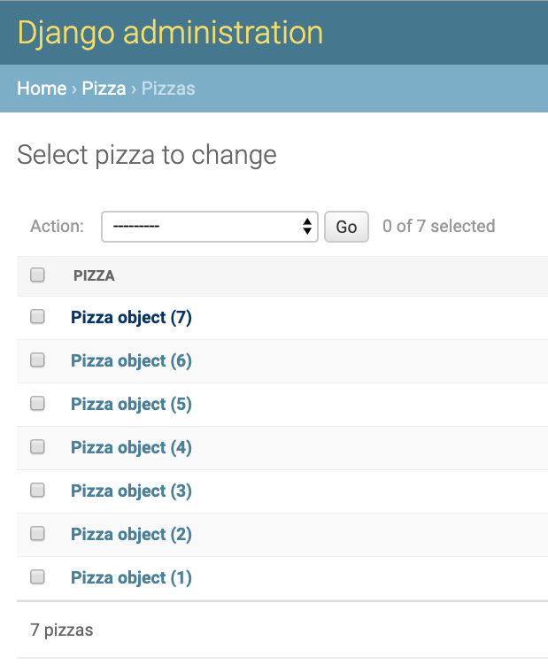
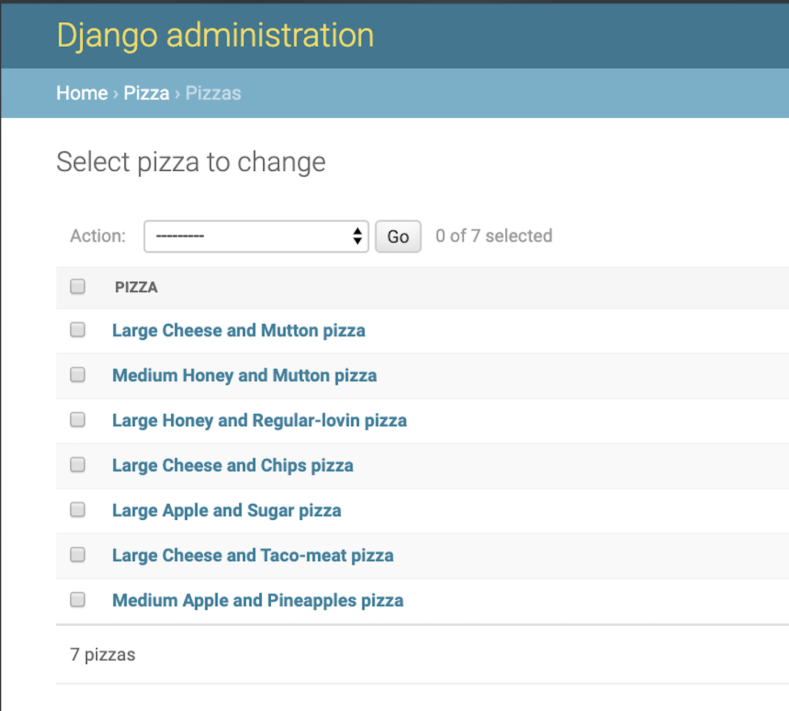

# 1\. create and activate \(env\_pizza\)

```
create github repo titled => django-forms
```

`git clone git@github.com:DevLuDaley/django-forms.git`

`cd django-forms`

`python3 -m venv env_pizza`

`source env_pizza/bin/activate`

```
access command palette
```

`cmd + shift + P`

`select python interpreter`

```
select ['env_pizza':venv] environment
```

# 2\. install django

```
clone master branch to create 'django-setup' branch

note:
  if you get an error pull the latest version of the master project from the remote repo.

  Now the local git knows about the new branch ('django-setup') created in remote git/GitHub
```

`git pull`

`git checkout setup_django`

`pip install django`

# 3\. create nandiasgarden project & folder

`django-admin startproject nandiasgarden`

# 4\. rename project folder to projectnandiasgarden

`mv nandiasgarden/ projectnandiasgarden`

* the tutorial says nandiasgarden-project but "name-project" produces an error in py 3.8\*\*
* rename project folder. add project to start of the name i.e folder => projectfolder or projectnandiasgarden for this project
* this helps differentiate between the project folder and the autogenerate folder (with the identaical project name) that lives in the project folder

open projectnandiasgarden

`cd projectnandiasgarden`

`django-admin startapp pizza`

# 5\. create pizza app

`django-admin startapp pizza`

# 6\. git checkout setup\_frontend

```
on Github, create new remote branch => setup_frontend
```

`git checkout setup_frontend`

# 7\. update urls & settings & views\.py

```
urls.py =>
    import views
    add url paths (home & order)
```

``` python
urls.py =>

from django.contrib import admin
from django.urls import path
from pizza import views

urlpatterns = [
    path('admin/', admin.site.urls),
    path('', views.home, name='home'),
    path('order', views.order, name='order'),

]
```

```
next we need to let settings.py know that this app exists
and add paths for home & order to views.py
```

```
settings.py =>

  add ['pizza'] to [installed_apps]
  update timezone variable to ['est']
```

``` python
settings.py =>

INSTALLED_APPS = [
    'django.contrib.admin',
    'django.contrib.auth',
    'django.contrib.contenttypes',
    'django.contrib.sessions',
    'django.contrib.messages',
    'django.contrib.staticfiles',
    'pizza',
]

...

TIME_ZONE = 'EST'
```

```
IMAGE
views.py =>


    create paths for home
    create paths for order
```

``` python
views.py =>

from django.shortcuts import render


def home(request):
    return render(request, 'pizza/home.html')

def order(request):
    return render(request, 'pizza/order.html')
```

```
create templates/pizza/ path inside of pizza app
create home.html and order.html inside of templates folder
```

```
home.html =>
  add title and href to order page

order.html =>
  add title and href to home page
```

``` html
home.html =>

<h1>Nandia's Garden</h1>
<a href="">Order a Pizza</a>
```

``` html
order.html=>

<h1>Order a Pizza</h1>
<a href="">Return to home page</a>
```

```
prompted by vs code to install autopep8
install autopep8
```

`env_pizza/bin/python -m pip install -U autopep8`

`Collecting autopep8 Downloading https://files.pythonhosted.org/packages/12/55/7b07585ca0c30e5b216e4d627f82f96f1a7e82d2dd727b1f926cb3f3d58b/autopep8-1.5.tar.gz (116kB) |████████████████████████████████| 122kB 4.3MB/s Collecting pycodestyle>=2.5.0 (from autopep8) Using cached https://files.pythonhosted.org/packages/0e/0c/04a353e104d2f324f8ee5f4b32012618c1c86dd79e52a433b64fceed511b/pycodestyle-2.5.0-py2.py3-none-any.whl Installing collected packages: pycodestyle, autopep8 Running setup.py install for autopep8 ... done Successfully installed autopep8-1.5 pycodestyle-2.5.0`

```
confirm
    1. home and order pages are loading as expected.
    2. the url link on each page is working.
```

```
on Github =>
    clone branch 3_setup_frontend
    create new branch 4_setup_data

in terminal =>
    checkout to new branch
```

# 8\. order\.html =\> add fields for toppings and size choices

```
debugged 2 errors in 2 files

  views.py =>
   1st -
    forgot to wrap url in ''

   urls.py =>
    2nd -
     forgot to add 'order' to path instead of just "" aka empty string
```

```
order.html =>
  - add 2 topping fields
  - 1 option field (3 options [small, medium, large])
```

``` html
order.html => <
<h1>Order a Pizza</h1>

<form>
  <label for="topping1">Topping 1: </label>
  <input id="topping1" type="text" name="topping1" />

  <label for="topping2">Topping 2: </label>
  <input id="topping2" type="text" name="topping2" />

  <label for="size">Size: </label>
  <select id="size" name="size">
    <option value="Small">Small</option>
    <option value="Medim">Medium</option>
    <option value="Large">Large</option>
  </select>
</form>

<a href="">Return to home page</a>
```

# 9\. order\.html =\> add 'submit' \(order\) button

```
order.html =>
  - add submit (order) button
  - add 'action' to (form) meta tag
  - update form action to point to 'order' page with a 'get' method
```

``` html
order.html =>

<form action="" method="get">
   ...

  <input type="submit" value="Order Pizza" />
</form>
```

# 10\. order\.html =\> change 'get' to 'post' \+ add \{% csrf\_token %\}

```
before hitting "order pizza" button http://127.0.0.1:8000/order?toping1=&toping2=&size=Small

after hitting "order pizza" button http://127.0.0.1:8000/order?toping1=Cheese&toping2=Pepperoni&size=Medium

'get' method displays and passes along info from the page
when should we use a 'get' method?
--whenever not changing anything on a website or you want something to be able to be referenced later.

we'll use a POST method instead...we only set up a 'get' initially as a test to see the data being passed.
```

```
error when hitting submit with 'post' instead of 'get'
[----Reason given for failure:
```

```
CSRF token missing or incorrect.]
```

```
order.html =>
  - add 
  - refresh the page and re-enter info
```

``` html
order.html => - change method to 'post' - add csrf token

<form action="" method="post">
   ...

  <input type="submit" value="Order Pizza" />
</form>
```

# 11\. create forms\.py \+ PizzaForm & update views\.py and order\.html

```
forms.py =>

  - create [forms.py] inside the Pizza folder
  - import forms
  - create the [PizzaForm] class and add all 3 fields for toppings and size

- views.py =>
  [from .forms import PizzaForm]
  edit order method
```

``` python
forms.py =>

from django import forms


class PizzaForm(forms.Form):
    topping1 = forms.CharField(label='Topping 1', max_length=100)
    topping2 = forms.CharField(label='Topping 2', max_length=100)
    size = forms.ChoiceField(label='Size', choices=[(
        'Small', 'Small'), ('Medium', 'Medium'), ('Large', 'Large')])
```

```
views.py =>
  [from .forms import PizzaForm]
  edit order method
```

``` python
views.py =>

from django.shortcuts import render
from .forms import PizzaForm


def home(request):
    return render(request, 'pizza/home.html')


def order(request):
    form = PizzaForm()
    return render(request, 'pizza/order.html', {'pizzaform': form})
```

```
order.html =>
remove or comment out labels/input fields
```

``` html
order.html =>

<h1>Order a Pizza</h1>

<form action="" method="post">
   {{ pizzaform }}

  <input type="submit" value="Order Pizza" />
</form>

<a href="">Return to home page</a>
```

```
github =>
create [setup_data] branch
```

`git pull`

`git checkout 4_setup_data`

# 12\. git checkout 4\_setup\_data

# 13\. views\.order\(\) =\> add logic to validate data as cleaned\_data \+ \{\{note\}\} for succesful order placed

```
views.py =>

- setup conditional for POST method
- add <h2>{{ note }}</h2>
- change [form] to [new_form] 2 instances so do this twice
- declare [new_form=""] before calling it
- declare [note=""] before calling it
- add .capitalize() to topping1 & topping2
```

``` python
views.py =>

from django.shortcuts import render
from .forms import PizzaForm


def home(request):
    return render(request, 'pizza/home.html')


def order(request):
    if request.method == 'POST':
        filled_form = PizzaForm(request.POST)
        if filled_form.is_valid():
            note = 'Thanks for ordering! Your %s %s and %s pizza is on its way!' % (
                filled_form.cleaned_data['size'],
                filled_form.cleaned_data['topping1'].capitalize(),
                filled_form.cleaned_data['topping2'].capitalize())
        else:
            note = 'Order was not created, please try again'
        new_form = PizzaForm()
        return render(request, 'pizza/order.html', {'pizzaform': new_form, 'note': note})
    else:
        form = PizzaForm()
        return render(request, 'pizza/order.html', {'pizzaform': form})
```

```
order.html =>

-Give access to [note] variable.
-
```

``` html
order.html =>

<h1>Order a Pizza</h1>

<h2>{{ note }}</h2>

<form action="" method="post">
   {{ pizzaform }} ...
</form>
```

# 14\. create && register 2 models \[Pizza\, Size\]

```
models.py =>

- create Size and Pizza classes
- use **str**(self) to display title of models in form and admin panel.

- Size uses Foreign Key and must cascade

CASCADE = if one thing is deleted we will also delete the object that has that relationship (? research this more)
```

``` python
models.py =>

from django.db import models


class Size(models.Model):
    title = models.CharField(max_length=100)

    def __str__(self):
        return self.title


class Pizza(models.Model):
    topping1 = models.CharField(max_length=100)
    topping2 = models.CharField(max_length=100)
    size = models.ForeignKey(Size, on_delete=models.CASCADE)
```

```
admin.py =>

import Pizza, Size
register 2 new models (Pizza, Size)

- [admin.site.register(Pizza)]
- [admin.site.register(Size)]
```

``` python
admin.py =>

from django.contrib import admin
from .models import Pizza, Size

admin.site.register(Pizza)
admin.site.register(Size)
```

# 15\. migrate models to db

`cd projectnandiasgarden`

`python manage.py makemigrations`

`python manage.py migrate`

# 16\. create superuser

```
create superuser profile for login to django admin site.
```

`python manage.py createsuperuser`

```
terminal output =>

Username
        (leave blank to use 'lhd'):
        admin_django_forms
Email address:

password

Superuser created successfully.
```

```
[localhost](http://127.0.0.1:8000/)/admin =>

- login as superuser at http://127.0.0.1:8000/admin
- create 3 new sizes "Small" "Medium" "Large"
```

```
Github =>

- create new remote branch =>
    5_setup_form_refactor
```

`git pull`

`git checkout 5_setup_form_refactor`

# 17\. git checkout 5\_setup\_form\_refactor

# 18\. refactor: from form to django ModelForm \+ update spacing in topping labels

```
forms.py =>

comment out the previous [PizzaForm] class from [forms.Form] in favor of [PizzaForm ][forms.ModelForm]
```

``` python
forms.py =>

from django import forms
from .models import Pizza

"""
class PizzaForm(forms.Form):
    topping1 = forms.CharField(label='Topping 1', max_length=100)
    topping2 = forms.CharField(label='Topping 2', max_length=100)
    size = forms.ChoiceField(label='Size', choices=[(
        'Small', 'Small'), ('Medium', 'Medium'), ('Large', 'Large')])

"""
class PizzaForm(forms.ModelForm):
    class Meta:
        model = Pizza
        fields = ['topping1', 'topping2', 'size']
        labels = {
            "topping1": "Topping 1",
            "topping2": "Topping 2",
        }
```

```
Github =>

- create new remote branch =>
    6_setup_widgets
```

`git pull`

`git checkout 6_setup_widgets`

# 19\. git checkout 6\_setup\_widgets

# 20\. update sidecar

# 21\. customize using wigets

`cd ..`

or

`cd django-forms`

`source env_pizza/bin/activate`

`cd projectnandiasgarden`

``` python
forms.py

from django import forms
from .models import Pizza


class PizzaForm(forms.Form):
    topping1 = forms.CharField(
        label='Topping 1', max_length=100, widget=forms.Textarea)
    topping2 = forms.CharField(label='Topping 2', max_length=100)
    size = forms.ChoiceField(label='Size', choices=[(
        'Small', 'Small'), ('Medium', 'Medium'), ('Large', 'Large')])


"""
class PizzaForm(forms.ModelForm):
    class Meta:
        model = Pizza
        fields = ['topping1', 'topping2', 'size']
        labels = {
            "topping1": "Topping 1",
            "topping2": "Topping 2",
        }
"""
```

add text area

``` python
forms.py =>
class PizzaForm(forms.Form):
    topping1 = forms.CharField(
        label='Topping 1', max_length=100, widget=forms.Textarea)
    topping2 = forms.CharField(label='Topping 2', max_length=100)
    size = forms.ChoiceField(label='Size', choices=[(
        'Small', 'Small'), ('Medium', 'Medium'), ('Large', 'Large')])
```

``` python
forms.py =>

class PizzaForm(forms.Form):
    topping1 = forms.CharField(
        label='Topping 1', max_length=100, widget=forms.PasswordInput)
    topping2 = forms.CharField(label='Topping 2', max_length=100)
    size = forms.ChoiceField(label='Size', choices=[(
        'Small', 'Small'), ('Medium', 'Medium'), ('Large', 'Large')])
```

``` python
forms.py =>

class PizzaForm(forms.Form):
    toppings = forms.MultipleChoiceField(
        choices=[('pep', 'Pepperoni'), ('cheese', 'Cheese'), ('olives', 'Olives')])
"""
    topping1 = forms.CharField(
        label='Topping 1', max_length=100, widget=forms.Textarea)
    topping2 = forms.CharField(label='Topping 2', max_length=100)
"""
size = forms.ChoiceField(label='Size', choices=[(
    'Small', 'Small'), ('Medium', 'Medium'), ('Large', 'Large')])
```

[image of pizza order page ] 

```python

from django import forms
from .models import Pizza


class PizzaForm(forms.Form):
    toppings = forms.MultipleChoiceField(
        choices=[('pep', 'Pepperoni'), ('cheese', 'Cheese'), ('olives', 'Olives')], widget=forms.CheckboxSelectMultiple)
    size = forms.ChoiceField(
        label='Size', choices=[(
            'Small', 'Small'), ('Medium', 'Medium'), ('Large', 'Large')])

```

```python
forms.py
class PizzaForm(forms.ModelForm):
    class Meta:
        model = Pizza
        fields = ['topping1', 'topping2', 'size']
        labels = {
            "topping1": "Topping 1",
            "topping2": "Topping 2",
        }
        widgets = {"topping1":forms.Textarea}
```

` size = forms.ModelChoiceField(queryset=Size.objects, empty_label=None, widget=forms.CheckboxSelectMultiple)`
```
we use radio the select button for size because it only allows for one selection in the list of choices and we would rather only allow users to select 1 size.
```

` size = forms.ModelChoiceField(queryset=Size.objects, empty_label=None, widget=forms.RadioSelect)`

github
create new branch named '7_setup_forms_and_files'

`git checkout setup_forms_and_files`

# 22. git checkout_7_forms_and_files


accepting files using forms
add enctype to order.html

```html
 order. html

<h1>Order a Pizza</h1>

<h2>{{ note }}</h2>

<form enctype="multipart/form-data" action="" method="post">
     {{ pizzaform }}

    <input type="submit" value="Order Pizza">
</form>

<a href="">Return to home page</a>

```
install pillow to allow us to receive files.

`pip install pillow`

add ImageField to forms.py

```python
forms.py

class PizzaForm(forms.ModelForm):
    #size = forms.ModelChoiceField(queryset=Size.objects, empty_label=None, widget=forms.RadioSelect)

    image = forms.ImageField()

    class Meta:

        model = Pizza
        fields = ['topping1', 'topping2', 'size']
        labels = {
            "topping1": "Topping 1",
            "topping2": "Topping 2",
        }
```

upate views to include `request.FILES` eventhough it didn't work on my machine

```python
def order(request):
    if request.method == 'POST':
        filled_form = PizzaForm(request.POST, request.FILES)
        if filled_form.is_valid():
            note = 'Thanks for ordering! Your %s %s and %s pizza is on its way!' % (
                filled_form.cleaned_data['size'],
                filled_form.cleaned_data['topping1'].capitalize(),
                filled_form.cleaned_data['topping2'].capitalize())
        else:
            note = 'Order was not created, please try again'
        new_form = PizzaForm()
        return render(request, 'pizza/order.html', {'pizzaform': new_form, 'note': note})
    else:
        form = PizzaForm()
        return render(request, 'pizza/order.html', {'pizzaform': form})


```

`git checkout 8_setup_formsets`

# 23. git checkout 8_setup_formsets

add text and a submit box for more pizzas

```python
order.html

<h1>Order a Pizza</h1>

<h2>{{ note }}</h2>

<form action="" method="post">
     {{ pizzaform }}

    <input type="submit" value="Order Pizza">
</form>

<br>
<br> want more than one pizza?

<form action="" method="get">
    {{ multiple_form}}
    <input type="submit" value="Get Pizzas">
</form>

<a href="">Return to home page</a>
```
if we reload the page we get an error. that's because there is no path for pizzas, yet. Let's set one up

```python
urls.py

from django.contrib import admin
from django.urls import path
from pizza import views

urlpatterns = [
    path('admin/', admin.site.urls),
    path('', views.home, name='home'),
    path('order', views.order, name='order'),
    path('pizzas', views.pizzas, name='pizzas'),
]
```
now we'll add a new class in forms.

```py
forms.py

class MultiplePIzzaForm(forms.Form):
    number = forms.IntegerField(min_value=2, max_value=6)
```


```py
views.py

from django.shortcuts import render
from .forms import PizzaForm, MultiplePIzzaForm


def home(request):
    return render(request, 'pizza/home.html')


def order(request):
    multiple_form = MultiplePIzzaForm()
    if request.method == 'POST':
        filled_form = PizzaForm(request.POST, request.FILES)
        if filled_form.is_valid():
            note = 'Thanks for ordering! Your %s %s and %s pizza is on its way!' % (
                filled_form.cleaned_data['size'],
                filled_form.cleaned_data['topping1'].capitalize(),
                filled_form.cleaned_data['topping2'].capitalize())
        else:
            note = 'Order was not created, please try again'
        new_form = PizzaForm()
        return render(request, 'pizza/order.html', {'pizzaform': new_form, 'note': note, 'multiple_form': multiple_form})
    else:
        form = PizzaForm()
        return render(request, 'pizza/order.html', {'pizzaform': form, 'multiple_form': multiple_form})
```

create formet class and conditionals to handle post and else => get requests

```py
views.py

from django.shortcuts import render
from .forms import PizzaForm, MultiplePizzaForm
from django.forms import formset_factory


def home(request):
    return render(request, 'pizza/home.html')


def order(request):
    multiple_form = MultiplePizzaForm()
    if request.method == 'POST':
        filled_form = PizzaForm(request.POST, request.FILES)
        if filled_form.is_valid():
            note = 'Thanks for ordering! Your %s %s and %s pizza is on its way!' % (
                filled_form.cleaned_data['size'],
                filled_form.cleaned_data['topping1'].capitalize(),
                filled_form.cleaned_data['topping2'].capitalize())
        else:
            note = 'Order was not created, please try again'
        new_form = PizzaForm()
        return render(request, 'pizza/order.html', {'pizzaform': new_form, 'note': note, 'multiple_form': multiple_form})
    else:
        form = PizzaForm()
        return render(request, 'pizza/order.html', {'pizzaform': form, 'multiple_form': multiple_form})


def pizzas(request):
    number_of_pizzas = 2
    filled_multiple_pizza_form = MultiplePizzaForm(request.GET)
    if filled_multiple_pizza_form.is_valid():
        number_of_pizzas = filled_multiple_pizza_form.cleaned_data['number']
    PizzaFormSet = formset_factory(PizzaForm, extra=number_of_pizzas)
    formset = PizzaFormSet()
    if request.method == 'POST':
        filled_formset = PizzaFormSet(request.POST)
        if filled_formset.is_valid():
            for form in filled_formset:
                print(form.cleaned_data['topping1'])
            note = 'Pizzas have been ordered!'
        else:
            note = 'order was not created buddy, please try again'
        return render(request, 'pizza/pizzas.html', {'note': note, 'formset': formset})
    else:
        return render(request, 'pizza/pizzas.html', {'formset': formset})

```

create pizzas/html


add
`   filled_form.save()`
to views.py in the [order] method

add url for editing orders
```py

"""nandiasgarden URL Configuration

The `urlpatterns` list routes URLs to views. For more information please see:
    https://docs.djangoproject.com/en/2.2/topics/http/urls/
Examples:
Function views
    1. Add an import:  from my_app import views
    2. Add a URL to urlpatterns:  path('', views.home, name='home')
Class-based views
    1. Add an import:  from other_app.views import Home
    2. Add a URL to urlpatterns:  path('', Home.as_view(), name='home')
Including another URLconf
    1. Import the include() function: from django.urls import include, path
    2. Add a URL to urlpatterns:  path('blog/', include('blog.urls'))
"""
from django.contrib import admin
from django.urls import path
from pizza import views

urlpatterns = [
    path('admin/', admin.site.urls),
    path('', views.home, name='home'),
    path('order', views.order, name='order'),
    path('pizzas', views.pizzas, name='pizzas'),
    path('order/<int:pk>', views.edit_order, name='edit_order'),
]

```
create new function


```py

from django.shortcuts import render
from .forms import PizzaForm, MultiplePizzaForm
from django.forms import formset_factory
from .models import Pizza


def home(request):
    return render(request, 'pizza/home.html')


def order(request):
    multiple_form = MultiplePizzaForm()
    if request.method == 'POST':
        filled_form = PizzaForm(request.POST, request.FILES)
        if filled_form.is_valid():
            created_pizza = filled_form.save()
            created_pizza_pk = created_pizza.id
            note = 'Thanks for ordering! Your %s %s and %s pizza is on its way!' % (
                filled_form.cleaned_data['size'],
                filled_form.cleaned_data['topping1'].capitalize(),
                filled_form.cleaned_data['topping2'].capitalize())
        else:
            note = 'Order was not created, please try again'
        new_form = PizzaForm()
        return render(request, 'pizza/order.html', {'created_pizza_pk': created_pizza_pk, 'pizzaform': new_form, 'note': note, 'multiple_form': multiple_form})
    else:
        form = PizzaForm()
        return render(request, 'pizza/order.html', {'pizzaform': form, 'multiple_form': multiple_form})


def pizzas(request):
    number_of_pizzas = 2
    filled_multiple_pizza_form = MultiplePizzaForm(request.GET)
    if filled_multiple_pizza_form.is_valid():
        number_of_pizzas = filled_multiple_pizza_form.cleaned_data['number']
    PizzaFormSet = formset_factory(PizzaForm, extra=number_of_pizzas)
    formset = PizzaFormSet()
    if request.method == 'POST':
        filled_formset = PizzaFormSet(request.POST)
        if filled_formset.is_valid():
            for form in filled_formset:
                print(form.cleaned_data['topping1'])
            note = 'Pizzas have been ordered!'
        else:
            note = 'order was not created buddy, please try again'
        return render(request, 'pizza/pizzas.html', {'note': note, 'formset': formset})
    else:
        return render(request, 'pizza/pizzas.html', {'formset': formset})


def edit_order(request, pk):
    pizza = Pizza.objects.get(pk=pk)
    form = PizzaForm(instance=pizza)
    if request.method == 'POST':
        filled_form = PizzaForm(request.POST, instance=pizza)
        if filled_form.is_valid():
            filled_form.save()
            form = filled_form
    return render(request, 'pizza/edit_order.html', {'pizzaform': form, 'pizza': pizza})

```
`git checkout 9_setup_errors_local_vs_server_based`

```py
add to views.py

def edit_order(request, pk):
    pizza = Pizza.objects.get(pk=pk)
    form = PizzaForm(instance=pizza)
    if request.method == 'POST':
        filled_form = PizzaForm(request.POST, instance=pizza)
        if filled_form.is_valid():
            filled_form.save()
            form = filled_form
            note = 'Order has been updated.'
            return render(request, 'pizza/edit_order.html', {'note': note, 'pizzaform': form, 'pizza': pizza})
    return render(request, 'pizza/edit_order.html', {'pizzaform': form, 'pizza': pizza})
```
```py
update views.py


def order(request):
    multiple_form = MultiplePizzaForm()
    if request.method == 'POST':
        filled_form = PizzaForm(request.POST, request.FILES)
        if filled_form.is_valid():
            created_pizza = filled_form.save()
            created_pizza_pk = created_pizza.id
            note = 'Thanks for ordering! Your %s %s and %s pizza is on its way!' % (
                filled_form.cleaned_data['size'],
                filled_form.cleaned_data['topping1'].capitalize(),
                filled_form.cleaned_data['topping2'].capitalize())
            filled_form = PizzaForm()
        else:
            created_pizza_pk = None
            note = 'Order was not created, please try again.'

        return render(request, 'pizza/order.html', {'created_pizza_pk': created_pizza_pk, 'pizzaform': filled_form, 'note': note, 'multiple_form': multiple_form})
    else:
        form = PizzaForm()
        return render(request, 'pizza/order.html', {'pizzaform': form, 'multiple_form': multiple_form})


```

add note to edit_order.
html
```html
edit_order.html

<h1>Edit Pizza</h1>

<h2> {{ note }} </h2>


<form action="" method="post">
    

    {{ pizzaform }}

    <input type="submit" value="Update Pizza">
</form>

<a href="">Return to home page</a>

```


```py
forms.py
if post request is not valid we need to return a message.

```


```py
models.py
before

from django.db import models


class Size(models.Model):
    title = models.CharField(max_length=100)

    def __str__(self):
        return self.title


class Pizza(models.Model):
    topping1 = models.CharField(max_length=100)
    topping2 = models.CharField(max_length=100)
    size = models.ForeignKey(Size, on_delete=models.CASCADE)

```



```py
models.py
after

from django.db import models


class Size(models.Model):
    title = models.CharField(max_length=100)

    def __str__(self):
        return self.title


class Pizza(models.Model):
    topping1 = models.CharField(max_length=100)
    topping2 = models.CharField(max_length=100)
    size = models.ForeignKey(Size, on_delete=models.CASCADE)

    def __str__(self):
        return (f'{self.size} {self.topping1.capitalize()} and {self.topping2.capitalize()} pizza')
```

    

```py
views.py

def order(request):
    multiple_form = MultiplePizzaForm()
    if request.method == 'POST':
        filled_form = PizzaForm(request.POST, request.FILES)
        if filled_form.is_valid():
            created_pizza = filled_form.save()
            created_pizza_pk = created_pizza.id
            note = 'Thanks for ordering! Your %s %s and %s pizza is on its way!' % (
                filled_form.cleaned_data['size'],
                filled_form.cleaned_data['topping1'].capitalize(),
                filled_form.cleaned_data['topping2'].capitalize())
            filled_form = PizzaForm()
        else:
            created_pizza_pk = None
            note = 'Order was not created, please try again'

        return render(request, 'pizza/order.html', {'created_pizza_pk': created_pizza_pk, 'pizzaform': filled_form, 'note': note, 'multiple_form': multiple_form})
    else:
        form = PizzaForm()
        return render(request, 'pizza/order.html', {'pizzaform': form, 'multiple_form': multiple_form})
```
```py
in order.html add novalidate
to view then remove it

<form action="" method="post" novalidate>

```
`current place =`
3:2
`server-based errors`